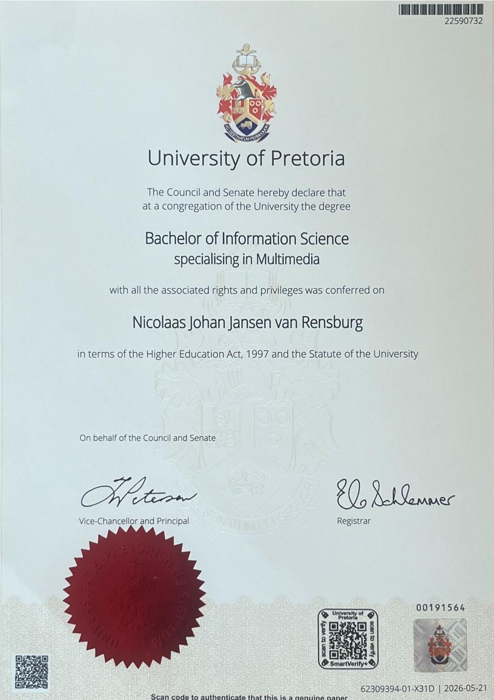

# Hi there, I'm Johan! 👋

I am a software and multimedia graduate from the University of Pretoria, where I completed my BIS Information Science degree specializing in Multimedia. I am currently a full-time Honours student in BIS Information Science specializing in Multimedia, and I am actively building experience for work opportunities in development, UX, and digital media.

I have completed the AWS Academy course and I am looking forward to completing my certification exam in the future. My background combines IT, visual arts, and practical university project experience, which has helped me grow into a versatile developer who enjoys solving real problems through thoughtful software.

<table>
	<tr>
		<td></td>
		<td></td>
	</tr>
</table>

## Contact

- LinkedIn: [Nicolaas Jansen van Rensburg](https://www.linkedin.com/in/nicolaas-jansen-van-rensburg-202629363/)
- GitHub: [22590732](https://github.com/22590732)
- Portfolio: [PDF CV / Portfolio](https://raw.githubusercontent.com/22590732/22590732/main/Johan_JvR_CV.pdf)
- Email: [u22590732@tuks.co.za](mailto:u22590732@tuks.co.za)

## Technical Skills

### Programming Languages

### Frameworks and Libraries

### Cloud and Development Tools

### Design Tools

## Featured University Projects

### SAMFMS

A scalable and modular fleet management system for my COS301 capstone project. I worked on the frontend and integration, and our team received the Software Excellence Award for the project.

Repo: https://github.com/COS301-SE-2025/SAMFMS

### Cove

My team's IMY320 project. It showcases UX research and the theory we learned in class.

Repo: https://github.com/SaskiaSteyn/IMY320

### Among the Guilty

My IMY300 year project. This Unity video game centres on a murder investigation and features a custom-built event system so that player decisions directly affect the investigation and the ending.

Repo: https://github.com/22590732/IMY300---Game

### Test-Driven Cloud Services Tutorial

A collaborative project with Saskia Steyn that uses React and AWS Cloud Services to teach test-driven development and cloud deployment. Each branch in the repository represents a stage of the tutorial.

Repo: https://github.com/SaskiaSteyn/imy772-workshop

## Personal Projects

These projects are separate from my university work and are built as passion projects in my free time.

### Corkboard Productivity

A digital version of the large whiteboard I used during my undergraduate studies to track notes, deadlines, and tasks.

Repo: https://github.com/22590732/Corkboard-Productivity

### FNAF

An ongoing recreation of the original Five Nights at Freddy's game. The project is written in JavaScript and focuses on recreating the core gameplay loop.

Repo: https://github.com/22590732/FNAF

### Letters to Jesus

An ongoing productivity app for Christians that is intended for mobile use.

Repo: https://github.com/22590732/Letters-To-Jesus

## What I'm Looking For

I am interested in opportunities where I can contribute to software development, frontend work, UX-focused projects, and cloud-enabled applications while continuing to grow my technical and creative skills.
